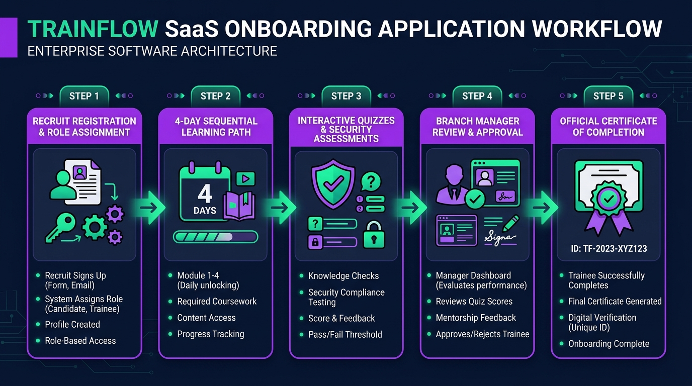
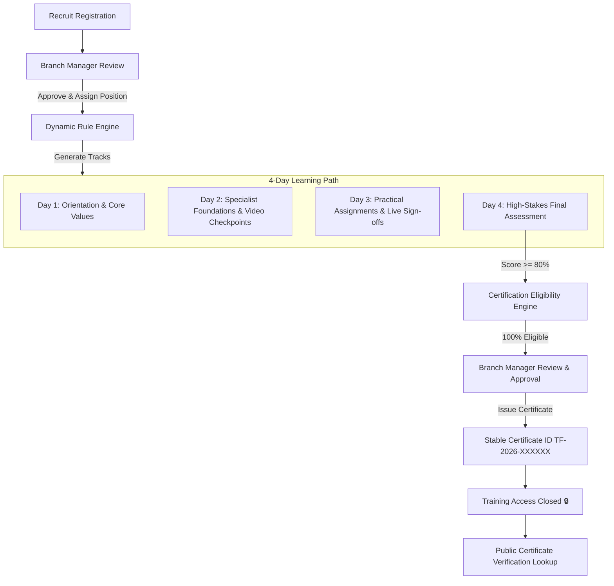

<div align="center">
  

  # ⚡ TrainFlow Enterprise Onboarding & Certification SaaS
  **Multi-Branch Training Management, Dynamic Rule Engine & Manager Certification Workflow**

  [](https://vitejs.dev/)
  [](https://reactjs.org/)
  [](LICENSE)
  [](https://github.com/Parth-Athu/trainflow)
</div>

---

## 📖 Overview

**TrainFlow** is a high-performance Enterprise Onboarding & Training Management Platform designed for multi-branch organizations across India. It automates role-based learning path generation, enforces strict completion rules, provides anti-cheating assessment environments, and empowers Branch Managers to review and issue official, verified Certificates of Completion.

---

## 🔄 End-to-End Onboarding Screen Flow



---

## 🏛️ Realistic Enterprise Role Hierarchy

TrainFlow establishes a 4-tier operational structure:

```
                  ┌────────────────────────┐
                  │      HQ HR ADMIN       │
                  └───────────┬────────────┘
                              │
               ┌──────────────┴──────────────┐
               ▼                             ▼
       12 REGIONAL BRANCH HUBS     ENTERPRISE RULE MATRIX
    (Ahmedabad, Surat, Rajkot...)   (Role + Level -> Tracks)
               │
               ▼
    ┌────────────────────┐
    │  BRANCH MANAGER    │  <-- Final Human Approval & Certificate Issuer
    └──────────┬─────────┘
               │
               ▼
    ┌────────────────────┐
    │     RECRUITS       │  <-- 4-Day Learning Curriculum & Badges
    └────────────────────┘
```

---

## Key Enterprise Features

### 1. ⚙️ Dynamic Rule Engine & Track Assignment
- Recruits do **NOT** manually choose training tracks.
- Entering a position (e.g. `Sales Executive` + `Junior`) automatically evaluates against the **Rule Engine** to assign required sub-modules (`Core Company Track`, `Sales Track`, `Operations Track`).

### 2. 📅 4-Day Sequential Curriculum Grid
- **Day 1**: Orientation & Code of Conduct *(Video & Reading)*
- **Day 2**: Specialist Competencies & 2-Minute Mid-Video Checkpoints *(Interactive Checkpoints)*
- **Day 3**: Practical Market Assignments & Manager Live Sign-offs *(File Uploads & Verification)*
- **Day 4**: High-Stakes Final Assessment & Certificate Review *(Pass Threshold: $\ge 80\%$)*
- **Strict Prerequisites**: Day 2 is locked until 100% of Day 1 modules are verified complete.

### 3. 🎯 Dedicated Quiz Session & Security Engine (`QuizSession.jsx`)
- **Live Countdown Timer**: 10-min situational quizzes & 20-min major assessments.
- **Question Navigator Pills**: Interactive numbered pills (Q1–Q10) for question jump & review.
- **Fisher-Yates Randomization**: Shuffles questions dynamically for each attempt.
- **Debounced Window Exit Security**: Listens to tab switching & window blur. Triggers Warning 1 & Warning 2 $\rightarrow$ 3rd exit terminates session (`TERMINATED`).
- **Educational Explanations Breakdown**: Post-quiz summary showing correct vs selected answers with key learning takeaways.

### 4. 🎓 Certification Eligibility Engine (`isRecruitCertificationEligible`)
- Branch Managers cannot issue certificates simply by clicking a button.
- The Eligibility Engine verifies:
  - `status === 'APPROVED'`
  - Days 1–4 are 100% complete
  - Mandatory sub-modules `COMPLETED`
  - Practical activities `APPROVED` (no pending revisions)
  - Live sessions `SIGNED OFF`
  - Final Exam score $\ge 80\%$
  - Zero `TERMINATED` security attempts

### 5. 🔒 Stable Certificate Issuance & Access Closure
- Generates a permanent unique Certificate ID: `TF-2026-XXXXXX` (e.g., `TF-2026-X8901`).
- Officially locks recruit training access (`🔒 CLOSED`).
- Recruits can view, print, or download their verified certificate at any time.

### 6. 🏆 Dynamic Badges & Gamified Achievements (9 Unlockable Badges)
- 🎬 **Video Apprentice**: Complete 1 video module.
- 📺 **Video Master**: Complete all assigned video modules.
- ⚡ **Checkpoint Pro**: Clear mid-video interactive checkpoints.
- 📜 **Policy Champion**: Verify Code of Conduct & Company Values.
- 🔥 **Streak Flame**: Maintain 4-day learning streak.
- 🎯 **Quiz Ace**: Score $\ge 90\%$ on any assessment.
- 🛠️ **Practical Star**: Assignment approved by Manager (Grade: A+).
- 🤝 **Live Session Star**: Complete manager live operational sign-off.
- 🏆 **Verified Graduate**: Earn official Certificate of Completion.

### 7. 🔍 Public Certificate Verification Search Tool
- Allows HR Admin or external auditors to input a Certificate ID (e.g. `TF-2026-X8901`) to inspect recipient candidate, program details, regional hub, issuer name, and timestamp.

---

## 🛠️ Tech Stack & Architecture

- **Frontend**: React 18 (Hooks, Context, Dynamic Components)
- **Build Tool**: Vite 5.4 (1.1s production bundle execution)
- **Styling**: Pure Vanilla CSS System (`index.css` with CSS Grid, Glassmorphism, Responsive Drawer & Desktop Sidebar Collapse)
- **Icons**: Lucide React
- **Persistence**: Browser LocalStorage Sync Engine (`trainflow_recruits_v4`, `trainflow_rules_v4`, `trainflow_audit_logs_v4`)

---

## 🚀 Quick Start Guide

### Prerequisites
Make sure you have **Node.js** (v16 or higher) installed.

### Installation

1. **Clone the Repository**:
   ```bash
   git clone https://github.com/Parth-Athu/trainflow.git
   cd trainflow
   ```

2. **Install Dependencies**:
   ```bash
   npm install
   ```

3. **Start Development Server**:
   ```bash
   npm run dev
   ```
   Open `http://localhost:3000/` (or `http://localhost:3013/`) in your browser.

4. **Build Production Bundle**:
   ```bash
   npm run build
   ```

---

## 📂 Project Directory Structure

```
trainflow/
├── public/
│   └── trainflow_screen_flow.jpg
├── src/
│   ├── components/
│   │   ├── ActivitySubmission.jsx      # Practical assignment submission form
│   │   ├── CertificateView.jsx         # Official Certificate renderer
│   │   ├── FullscreenAssessment.jsx    # Fullscreen exam modal with integrity monitor
│   │   ├── LearningReadinessWidget.jsx # AI Readiness Index gauge
│   │   ├── QuizSession.jsx             # Interactive quiz session & explanation breakdown
│   │   ├── RewardModal.jsx             # XP & Badge unlock popups
│   │   ├── Sidebar.jsx                 # Fixed sidebar with desktop collapse & mobile drawer
│   │   └── TopNavbar.jsx               # Sticky topbar with location & metrics
│   ├── data/
│   │   ├── badges.js                   # 9 Unlockable Badges catalog & dynamic calculator
│   │   ├── modules.js                  # 12 Onboarding Modules catalog
│   │   ├── recruits.js                 # Initial recruit dataset across 12 Hubs
│   │   └── rules.js                    # Enterprise Rule Matrix (Role + Level -> Tracks)
│   ├── pages/
│   │   ├── AchievementsView.jsx        # Dedicated Achievements & Badge Showcase tab
│   │   ├── HRDashboard.jsx             # National Command Center & Rule Matrix editor
│   │   ├── Login.jsx                   # SaaS 2-Column Auth & Account Type selector
│   │   ├── ManagerDashboard.jsx        # Branch Manager Command & Certification Center
│   │   ├── ModulePage.jsx              # Module router (Video, Reading, Live, Quiz)
│   │   ├── RecruitDashboard.jsx        # Recruit 4-Day Learning Path
│   │   └── RecruitProfile.jsx          # Recruit Employee Profile & Certification Card
│   ├── utils/
│   │   ├── learningEngine.js           # Rule Engine & Certification Eligibility Engine
│   │   └── storage.js                  # LocalStorage Persistence & Certificate Generator
│   ├── App.jsx                         # Main Routing & Application State
│   ├── main.jsx                        # React Root Entry Point
│   └── index.css                       # Design system, CSS grid tokens, & animations
├── index.html
├── package.json
├── vite.config.js
└── README.md
```

---

## 📝 Demo Credentials & Quick Logins

| Account Type | Name / Email | Role |
| :--- | :--- | :--- |
| **Recruit** | Priya Sharma (`priya.sharma@trainflow.io`) | Sales Executive (Junior) • Ahmedabad Hub |
| **Recruit** | Rahul Verma (`rahul.verma@trainflow.io`) | Operations Associate (Mid) • Surat Hub |
| **Branch Manager** | Amit Shah (`manager.ahmedabad@trainflow.io`) | Branch Manager • Ahmedabad Regional Hub |
| **Regional Trainer** | Field Trainer (`trainer@trainflow.io`) | Regional Operations Trainer |
| **HR Admin** | HQ HR Operations (`hr.admin@trainflow.io`) | National Training Command Center |

---

## 📜 License

Distributed under the **MIT License**. See `LICENSE` for more information.

---

<div align="center">
  Developed for Enterprise Multi-Branch Training Operations 🚀
</div>
